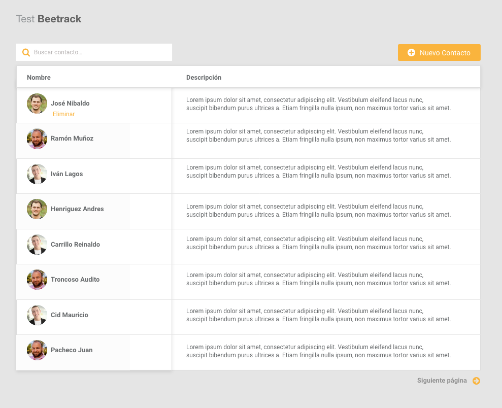
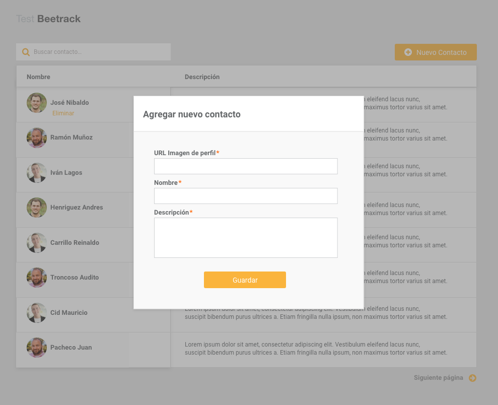

## Beetrack Front-end Test
### Introducción
La siguiente prueba busca evaluar los conocimientos en javascript, css y html. Para consultas, enviar un correo a [dev@beetrack.com](mailto:dev@beetrack.com).
### Descripción e instalación
Se adjunta un proyecto de nodejs, con una pequeña base de datos y una api ya desarrollada. Para ejecutar el proyecto, una vez descargado hay que correr las siguientes líneas por línea de comandos en el root del proyecto:
```
npm install
node server.js (para correr la API)
npm start (para correr el front)
```
Los requisitos son únicamente tener instalado una versión de `node >= 4` y `npm`.
Si todo funcionó correctamente, va a correr el servidor, y vas a poder acceder a través de cualquier navegador en la dirección: [localhost:3030](http://localhost:3030). Se debería visualizar el html ubicado en `public/index.html`.
### Desarrollo
El objectivo del test es desarrollar 2 vistas utilizando la api incluida en el proyecto.

La primera consiste en una lista paginada de usuarios con un buscador. Se debe visualizar la imagen del usuario con su respectivo nombre, y la descripción al lado, como se ve a continuación:



Al hacer hover en una fila, se debe mostrar un vínculo para eliminar dicho usuario a través de un AJAX. No es necesario que el paginador muestra el número de páginas; sólo un link para ir a la siguiente o la anterior.

La segunda vista consiste en el formulario para agregar un usuario. Se gatilla como modal al presionar el botón de `Nuevo Contacto` de la vista anterior. La única validación que debe hacer este formulario, es que verifique que se incluyen todos los campos. Una vez completado, al presionar el botón `Guardar` debe enviar la información por AJAX a la api para crear el usuario. La vista se muestra a continuación:


### Descripción de la API
El proyecto incluye la api y la base de datos de almacenamiento. La api es REST, y a continuación se especifican sus métodos:

| Método HTTP   | Ruta           | Descripción  |
| ------------- |:-------------  | -----|
| GET           | /api/users     | Devuelve la lista de todos los usuarios. Para paginar necesita recibir adicionalmente los parámetros `_page` y `_limit` : `/api/users?_page=2&_limit=10`. Para buscar, necesita el parámetro `q`: `/api/users?q=texto`|
| GET           | /api/users/:id |   Devuelve únicamente el usuario especificado por el id |
| POST          | /api/users     |    Crea un usuario nuevo. Debe incluir el header `Content-Type: application/json`, y los parámetros en formato JSON. Ej: `{"name": "Algún nombre","description": "Alguna descripción","photo": "Alguna URL"}`|
| DELETE        | /api/users/:id |    Elimina el usuario correspondiente al id dado. |
### Criterios de evaluación
Se pide específicamente el uso de [React](https://facebook.github.io/react/). Dará un valor adicional, aunque no es obligatorio, el uso además de [Redux](https://redux.js.org). Adicionalmente se evaluarán los siguientes puntos:
1. Utilización de patrones, buenas prácticas en el código y arquitectura acorde
2. Documentación en el código
3. Diseño lo más similar posible a las imágenes mostradas más arriba
4. Tiempo en realizar la tarea
### Plazos y envío
Esta prueba no considera plazos máximos de entrega, pero el tiempo es un criterio de evaluación, por lo que se espera una buen balance entre calidad y el tiempo usado. Una vez terminada la tarea, por favor adjuntar el proyecto modificado, y enviarlo a [dev@beetrack.com](mailto:dev@beetrack.com). Se recibirá sólo una entrega por candidato (solamente la primera), por lo tanto enviar cuando esté completamente listo.
